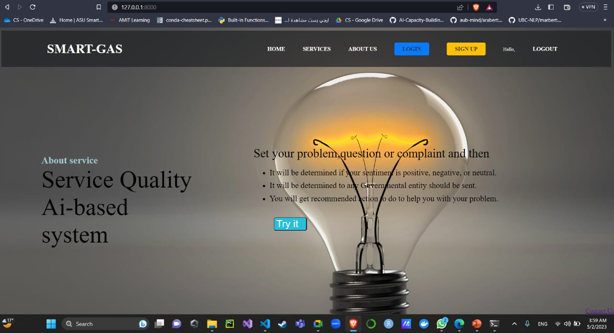
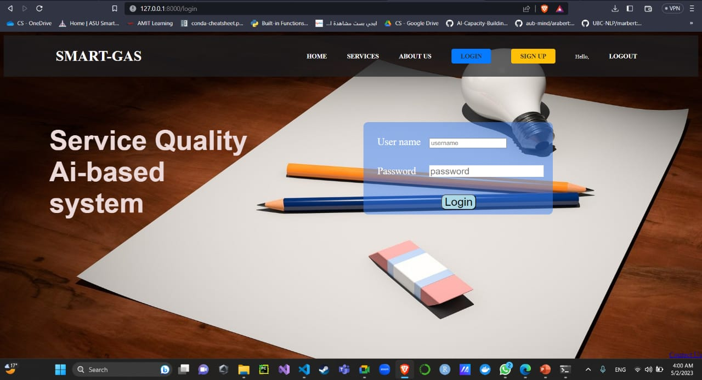
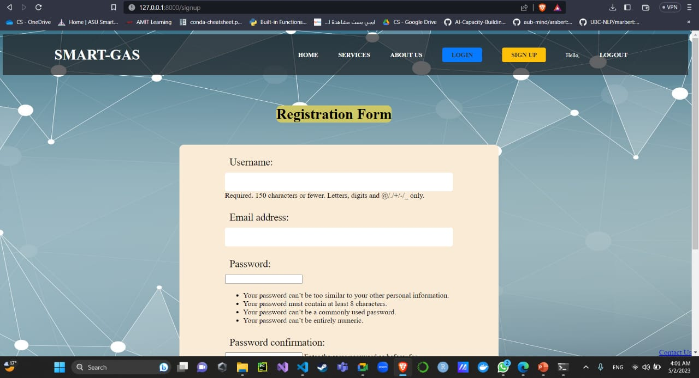
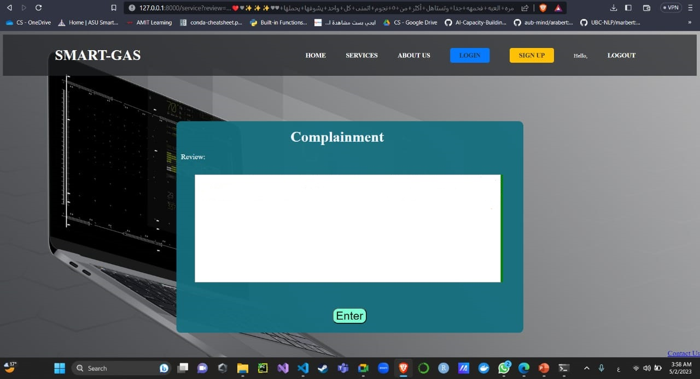
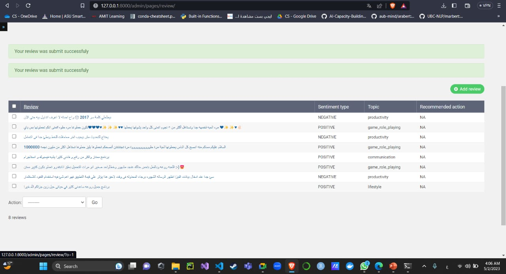
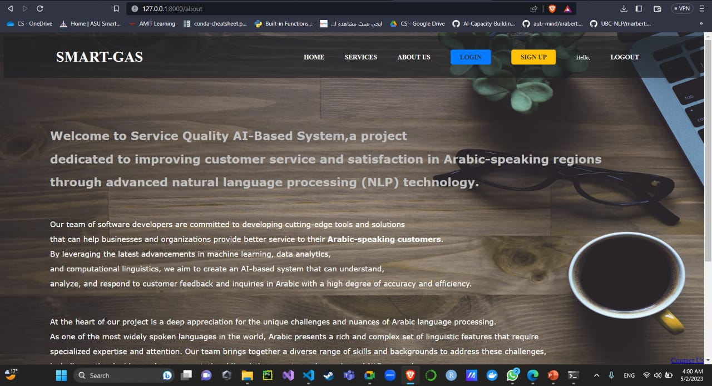

# Service-Quality-Ai-based-System
<h2>Service Quality Ai-based System is a cutting-edge platform designed to enhance customer service and support in various industries specifically in Arabic language.  
The main three tasks of the model: 
<ul> 
    <li>Topic classification(TC) </li>
    <li>Sentiment Analysis(SA)</li> 
    <li>Solution Generation</li></ul> 
However, we faced some challenges, difficulty accessing this sensitive information. To overcome this hurdle, web scraping is employed on governmental websites to gather relevant data related to citizen complaints.  
And the evaluation metrics were measured based on f1-score metric 
<ul><li>95.8% for Topic Classifictio and 96% for Sentiment Analysis</li></ul>
 
The deployment process is applied using frontend and 
backend development with Django framework.
</h2>
<table>
  <tr>
    <td></td>
    <td></td>
    <td></td>
  </tr>
  <tr>
    <td></td>
    <td></td>
    <td></td>
  </tr>
  
</table>
