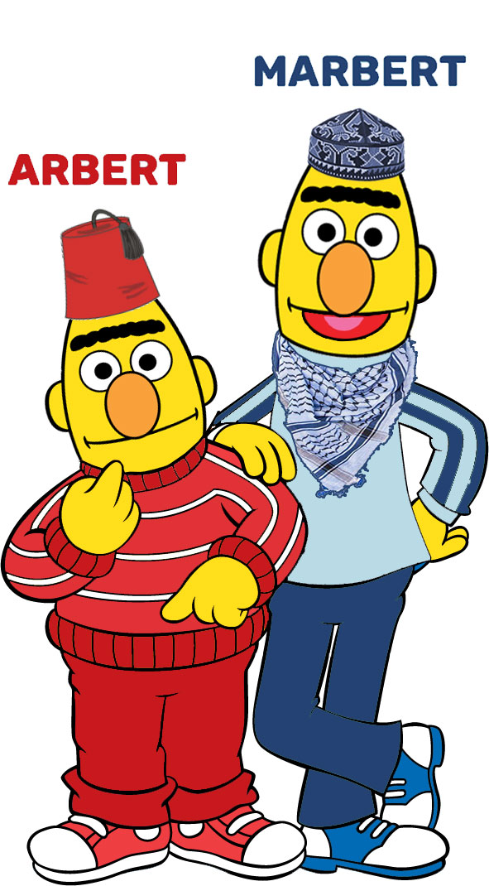

# Service Quality AI-Based System

## Introduction  


The **Service Quality AI-Based System** is a state-of-the-art platform developed to revolutionize customer service and support, with a focus on Arabic-language industries. It achieves this through advanced natural language processing (NLP) techniques tailored to analyze customer interactions and generate solutions efficiently.  

### Key Features :
- **Topic Classification**: Automatically categorizes customer queries into predefined topics (F1 Score: 95.8%).  
- **Sentiment Analysis**: Identifies the emotional tone of customer interactions (F1 Score: 96%).  
- **Solution Generation**: Provides actionable responses to customer queries.  

### Technologies Used :
- **Programming Language**: Python  
- **Framework**: Django  
- **AI Models**: MARBERT, ARBERT, GPT, MT5  
- **Tools**: Web scraping tools, tokenization libraries, hyperparameter tuning methods  

---

## Project Phases  

### 1. Data Gathering  
Data is collected using web scraping tools to ensure a comprehensive dataset covering diverse scenarios and linguistic nuances in Arabic. This supports robust training for the AI models.  

### 2. Data Preprocessing  
To prepare the data for training, it undergoes the following steps:  
- **Noise Removal**: Cleaning special characters and irrelevant text.  
- **Tokenization and Normalization**: Standardizing Arabic language data.  
- **Data Splitting**: Dividing data into training, validation, and test sets.  

### 3. Hyperparameter Tuning  
Hyperparameter optimization ensures the models perform optimally. This involves fine-tuning configurations such as learning rates, batch sizes, and architecture parameters.  

### 4. AI Models Utilized  
| **Task**                | **Model**   | **Dataset**                  | **F1 Score** |
|--------------------------|-------------|------------------------------|--------------|
| **Topic Classification** | MARBERT     | Merged Topics dataset    | 95.8%        |
| **Sentiment Analysis**    | ARBERT      | 100k revs & glare dataset     | 96.0%        |
| **Solution Generation**   | GPT, MT5    | Contextual solution dataset  | N/A          |

### 5. Deployment  
The system is deployed using a robust **Django framework**, providing:  
- A seamless **frontend** and **backend** experience.  
- A responsive and user-friendly interface for end-users.

  
<table>
  <tr>
    <td></td>
    <td></td>
    <td></td>
  </tr>
  <tr>
    <td></td>
    <td></td>
    <td></td>
  </tr>
  
</table>

---

## How It Works  
1. **Data Input**: Customer queries are ingested into the system.  
2. **Processing**: The platform performs topic classification, sentiment analysis, and solution generation.  
3. **Output**: Contextual responses or solutions are provided in real time.

---

## Colab Notebooks  

Explore the Colab notebooks for:  
- Topic Classification Notebook [](https://colab.research.google.com/drive/1Kyux7JPYJEbJKY3LjNZDhyezXChUQV0p?usp=sharing) 

*Click the links above to access the respective Colab notebooks and view the implementation details.*

---

## Benefits  
- Accurate and efficient processing of Arabic-language customer interactions.  
- Scalable and reliable system design.  
- Simplifies customer support and enhances service quality.  

---

## About the Models:
### ARBERT & MARBERT: Deep Bidirectional Transformers for Arabic


* introduce ```ARBERT``` and ```MARBERT```, two powerful Transformer-based language models for Arabic;
* introduce ```ArBench```, a multi-domain, multi-variety benchmark for Arabic naturaal language understanding based on 41 datasets across 5 different tasks and task clusters;
* evaluate ARBERT and MARBERT on ArBench and compare against available language models.

Model establish new state-of-the-art (SOTA) on all 5 tasks/task clusters on 37 out of the 41 datasets.
Language models are publicaly available for research (see below).
The rest of this repository provides more information about the language models, benchmark, and experiments.
### How to use ARBERT and MARBERT

#### Loading directly from Huggingface
You can use ARBERT and MARBERT with [Hugging Face's Transformers](https://github.com/huggingface/transformers) library as follow.
 
 ```python
    from transformers import AutoTokenizer, AutoModel
    #load AEBERT model from huggingface
    ARBERT_tokenizer = AutoTokenizer.from_pretrained("UBC-NLP/ARBERT")
    ARBERT_model = AutoModel.from_pretrained("UBC-NLP/ARBERT")
  
    #load MAEBERT model from huggingface
    MARBERT_tokenizer = AutoTokenizer.from_pretrained("UBC-NLP/MARBERT")
    MARBERT_model = AutoModel.from_pretrained("UBC-NLP/MARBERT") 
 ```
### 4.2 Example: Fine-tuning MARBERT for Sentiment Analysis
MARBERT Fine-Tuning demo with PyTorch checkpoint for Sentiment Analysis on the AJGT dataset [](https://colab.research.google.com/drive/1M0ls7EPUi1dwqIDh6HNfJ5y826XvcgGX?usp=sharing)

